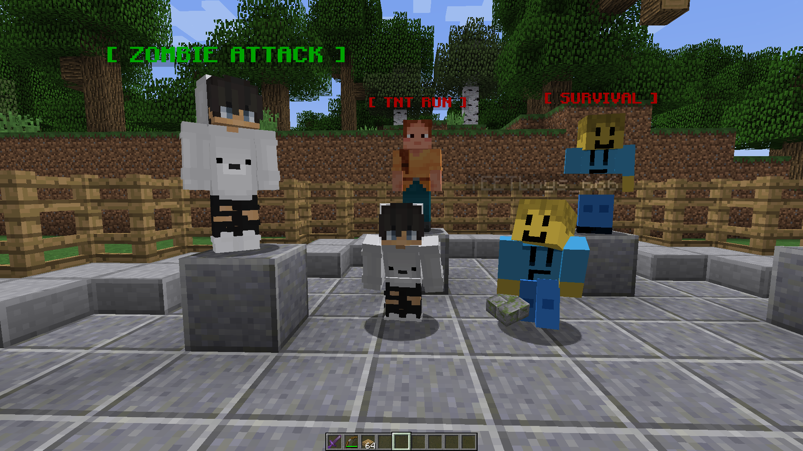

<!DOCTYPE html>
<html>

<head>
  <meta charset="utf-8">
  <meta name="viewport" content="width=device-width">
  <link href="style.css" rel="stylesheet" type="text/css" />
  <link href="images/server-icon.png" rel="shortcut icon">
</head>

<body>
  <header>
    

      

        <h1>Phorast</h1>
      

      <nav>
        <ul>
          <li class="current"><a href="index.html">Home</a></li>
          <li><a href="getIP.html">Get IP</a></li>
        </ul>
      </nav>
    

  </header>
  

    <section>
      <h2>A Minecraft Java Edition Server</h2>
      
      
Welcome to the official page of the Minecraft Java Edition Server called "Phorast"! Phorast is a server where you can play with your friends without setting up a server.   So far, we have Survival (Survival is basically the gamemode where you can just play in the wild far away from spawn.),   TNT Run (Don't fall off to the void or be the last one to fall! Last one alive wins!),   and Zombie Attack (An invasion of zombies attack your city, and the way out of the city is blocked off! You must defend yourself with resources.)! 

      

      <h1>You need the IP to play!</h1>
      <a href="getIP.html"><h3>Get the IP!</h3></a>
    </section>
  

  
  
</body>

</html>
